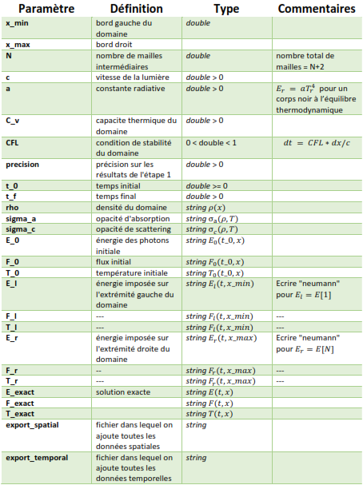

# Transfert Radiatif: Problème Inverse (MOCO)

### Objectif
Résolution du problème inverse de propagation de la lumière par la méthode des volumes finis en 1D et apprentissage de la densité par un réseau de neurones.

### Documents
- Indications et travail à faire: `doc/guidelines/projetM1.pdf`  
- Rapport de projet en anglais: `Report.pdf` ou `doc/eng/report.pdf`  
- Rapport de stage en français (pour la 2D): `doc/fr/rapport.pdf`  

## __1ère partie: Résolution de l'EDP__    
_Les commandes indiquées sont à exécuter à partir du répertoire racine du projet._

### Compilation
La première option est d'utiliser CMake:   
- __`rm -rf build`__
- __`cmake -H. -Bbuild`__  
- __`cmake --build build`__  

La deuxième option nécessite Docker et Visual Studio Code. Il faudra:  
- Se servir du fichier __Dockerfile.ci__ pour ouvrir le projet sous le conteneur   
- Compiler avec CMake.    

### Exécution
- Pour une simple exécution: __`build/transfer src/config/case_1.cfg`__
- Pour générer un tas de données à étudier: __`bash src/simu/gauss_dump.sh`__ 

__Format des fichiers de configuration:__  

### Résultats
- __`data/df_temporal.csv`__ pour les signaux aux bords du domaine en tous temps.
- __`data/df_spatial.csv`__ pour les signaux sur tout le domaine au temps final.

### Analyse des données
- Animations: [__`src/notebook/visualisation.ipynb`__](https://github.com/desmond-rn/projet-inverse/blob/master/src/notebook/visualisation.ipynb)
- Analyse des données: [`src/notebook/analyse_des_donnees.ipynb`](https://github.com/desmond-rn/projet-inverse/blob/master/src/notebook/analyse_des_donnees.ipynb).  

## __2ème partie: Reconstruction de la densité__   
- Apprentissage: [`src/notebook/reseaux_de_neurones.ipynb`](https://github.com/desmond-rn/projet-inverse/blob/master/src/notebook/Apprentissage.ipynb).

## Ressources utilisées:
- __muParser__ pour transformer des expressions en fonctions: [Exemple](https://beltoforion.de/article.php?a=muparser&s=idExample#idExample) - [Instructions](https://beltoforion.de/article.php?a=muparser&p=building)
